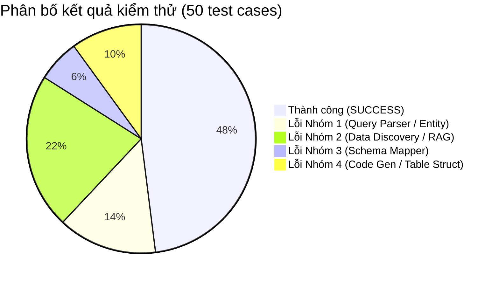
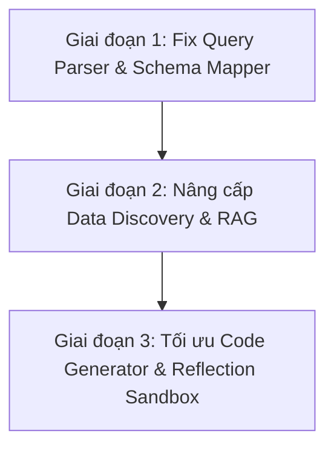

# BÁO CÁO PHÂN TÍCH TOÀN DIỆN DỮ LIỆU KIỂM THỬ PIPELINE (50 TEST CASES)
**Thư mục phân tích:** `D:\hobby_project\cocopila\r2AI_2026\pipeline\tests`  
**Thời gian thực hiện:** 26/08/2026  
**Nguồn dữ liệu:** `codegen_results.json`, `codegen_results.csv`, `pipeline_execution.txt`, và 50 file mã nguồn `test_q_*`

---

## 📊 1. Tổng quan Thống kê Thực thi Kiểm thử

Sau khi chạy thử nghiệm toàn bộ **50 câu hỏi kiểm thử tài chính** trong tập dữ liệu `pipeline/tests`, kết quả phân bổ như sau:

| Chỉ số | Số lượng | Tỷ lệ (%) | Chi tiết Question ID |
|:---|:---:|:---:|:---|
| **Tổng số câu hỏi kiểm thử** | **50** | **100.0%** | `Q1` đến `Q50` |
| **Thực thi Thành công (SUCCESS)** | **24** | **48.0%** | `1, 3, 4, 5, 6, 7, 9, 10, 14, 17, 18, 22, 23, 24, 25, 26, 31, 34, 40, 44, 45, 48, 49, 50` |
| **Thực thi Thất bại (ERROR)** | **26** | **52.0%** | `2, 8, 11, 12, 13, 15, 16, 19, 20, 21, 27, 28, 29, 30, 32, 33, 35, 36, 37, 38, 39, 41, 42, 43, 46, 47` |



---

## 🗂️ 2. Phân loại & Ma trận Lỗi (26 Test Thất bại)

Toàn bộ 26 trường hợp thất bại được phân tích chuyên sâu và phân loại thành **4 nhóm nguyên nhân chính** tại các tầng kiến trúc tương ứng trong pipeline:

| Nhóm | Tên nhóm lỗi | Tầng phát sinh | Số ca | Tỷ lệ trong lỗi | Danh sách Question ID |
|:---:|:---|:---|:---:|:---:|:---|
| **1** | **Query Parser & Entity Extraction** | Node 1 (Query Parser) | **7** | **26.9%** | `28, 30, 33, 38, 39, 42, 43` |
| **2** | **Data Discovery / RAG Retrieval** | Node 2 (Search Engine) | **11** | **42.3%** | `2, 8, 11, 16, 19, 20, 27, 29, 35, 36, 37` |
| **3** | **Schema Mapper Resolution** | Node 3 (Schema Mapper) | **3** | **11.5%** | `32, 41, 46` |
| **4** | **Code Generator & Data Organization** | Node 4 & 5 (Codegen / Exec) | **5** | **19.2%** | `12, 13, 15, 21, 47` |

---

## 🔍 3. Phân tích Chi tiết Từng Nhóm Lỗi

---

### 🔴 NHÓM 1: Query Parser & Trích xuất Thực thể Sai (7 tests - 26.9%)

> [!CAUTION]
> **Hiện tượng:** Mô hình ngôn ngữ ở Node 1 trích xuất sai Mã chứng khoán (Ticker), Tên công ty hoặc Chỉ tiêu mục tiêu ngay từ câu hỏi đầu vào, khiến các Node phía sau tìm kiếm sai hoàn toàn cơ sở dữ liệu.

```
[User Query] ──(Trích xuất sai Ticker/Chỉ tiêu)──> [Sai Ticker Vector Query] ──> [0 kết quả / Crash]
```

#### Chi tiết các ca lỗi:
1. **QID 28 (`CTCP` thay vì `NVL`)**:
   * *Câu hỏi:* "Tổng phải thu ngắn hạn khác của công ty mẹ CTCP Tập đoàn Đầu tư Địa ốc No Va đến ngày 31/12/2016..."
   * *Lỗi:* Query Parser trích xuất Ticker là `'CTCP'` thay vì `'NVL'`. Do đó, RAG tìm bảng của từ khóa 'CTCP' thay vì Novaland.
2. **QID 30 (`BVO` thay vì `BVH`)**:
   * *Câu hỏi:* "Tổng giá trị thuần khoản đầu tư góp vốn vào đơn vị khác của Tập đoàn Bảo Việt..."
   * *Lỗi:* Query Parser hallucinate ticker `'BVO'` (không tồn tại trong danh mục HOSE/HNX, mã đúng là `'BVH'`).
3. **QID 33 (`STB` thay vì `MBB`)**:
   * *Câu hỏi:* "Số dư dự phòng rủi ro cho vay khách hàng của Ngân hàng TMCP Quân đội..."
   * *Lỗi:* Query Parser trích xuất nhầm sang `'STB'` (Sacombank) thay vì `'MBB'` (Military Bank).
4. **QID 38 (`STB` thay vì `SHB`)**:
   * *Câu hỏi:* "Số dư thuế TNDN phải trả của Ngân hàng TMCP Sài Gòn - Hà Nội..."
   * *Lỗi:* Query Parser trích xuất `'STB'` thay vì `'SHB'`.
5. **QID 39 (`CTCP` thay vì `GVR`)**:
   * *Câu hỏi:* "Số dư phải thu phí quản lý tập trung của Tập đoàn Công nghiệp Cao su Việt Nam - CTCP..."
   * *Lỗi:* Query Parser trích xuất Ticker là `'CTCP'` do từ "CTCP" nằm ở đuôi tên công ty. Mã đúng là `'GVR'`.
6. **QID 42 (Trích xuất sai chỉ tiêu `Quỹ lương` → `Tiền và tương đương tiền`)**:
   * *Câu hỏi:* "Tổng quỹ lương năm 2022 của công ty mẹ EIB là bao nhiêu triệu đồng?"
   * *Lỗi:* Query Parser nạp chỉ tiêu `'Tổng tiền và các khoản tương đương tiền'` thay vì `'Quỹ lương'`.
7. **QID 43 (`CTCP` thay vì `ACV`)**:
   * *Câu hỏi:* "Nguyên giá xây dựng Nhà ga Hành khách T2 - CHKQT Nội Bài của Tổng Công ty Cảng Hàng không Việt Nam - CTCP..."
   * *Lỗi:* Trích xuất Ticker là `'CTCP'` thay vì `'ACV'`.

#### 💡 Nguyên nhân gốc rễ (Root Cause):
* LLM parser chưa có cơ chế tra cứu từ điển pháp nhân doanh nghiệp (Stock Entity Mapping Dictionary).
* Tên công ty Việt Nam thường có tiền tố `"CTCP"`, `"Tập đoàn"`, `"Tổng Công ty"` ở đầu hoặc đuôi, làm LLM nhầm lẫn `"CTCP"` là mã Ticker.

---

### 🟠 NHÓM 2: Data Discovery / RAG Retrieval Trả Sai Bảng (11 tests - 42.3%)

> [!WARNING]
> **Hiện tượng:** Ticker và Year đúng, nhưng RAG (Hybrid Dense Qdrant + BM25) trả về bảng báo cáo tài chính **không chứa chỉ tiêu chi tiết mà câu hỏi yêu cầu** do hiện tượng "Semantic & Keyword Collision".

#### Chi tiết các ca lỗi:
1. **QID 2 (ACB - Cho vay ngành Thương mại)**: RAG trả về bảng `table_100_0` (Tổng mức rủi ro tín dụng tối đa - chỉ có tổng cho vay), không phải bảng Thuyết minh phân loại cho vay theo ngành kinh tế.
2. **QID 8 (FPT - Chi phí lương)**: RAG trả về bảng `12. CHI PHÍ TRẢ TRƯỚC` (thuê văn phòng, phần mềm) do khớp từ khóa `"Khác"`, trong khi cần bảng Chi phí nhân viên/quản lý.
3. **QID 11 (BID - Tiền gửi tại TCTD khác)**: RAG trả về bảng `27. CHI PHÍ LÃI VÀ CÁC CHI PHÍ TƯƠNG TỰ` (khớp từ `"Trả lãi tiền gửi"` - chi phí) thay vì Bảng Cân đối kế toán (số dư tài sản tiền gửi).
4. **QID 16 (CEO - Vay ngắn hạn)**: RAG trả về bảng `table_3` là phần **TÀI SẢN (Assets)**, trong khi "Vay ngắn hạn" nằm ở phần **NỢ PHẢI TRẢ (Liabilities)**.
5. **QID 19 & 20 (HHV, GVR - Tỷ lệ quyền biểu quyết %)**: RAG trả về phần Vốn chủ sở hữu của Bảng CĐKT (chứa dòng "Cổ phiếu phổ thông có quyền biểu quyết" - đơn vị VND) thay vì Thuyết minh danh sách công ty con / công ty liên kết (chứa tỷ lệ %).
6. **QID 27 (DLG - Lưu chuyển tiền thuần đầu tư)**: RAG trả về bảng Lưu chuyển tiền thuần hoạt động tài chính.
7. **QID 29 (OGC - Trả trước người bán dài hạn)**: RAG trả về bảng Nợ xấu / Tiền mặt thiếu hụt (`table_28.csv`).
8. **QID 35 (BVH - Phải thu từ Bảo Việt Nhân thọ)**: RAG trả về bảng liệt kê quan hệ các bên liên quan (`table_44.csv`) thay vì bảng số dư công nợ phải thu chi tiết.
9. **QID 36 (VRE - Lợi thế thương mại)**: RAG trả về bảng Trình bày lại số liệu tương ứng (`table_66_0`) thay vì Thuyết minh tài sản vô hình / Lợi thế thương mại.
10. **QID 37 (GEX - Cam kết thuê hoạt động)**: RAG trả về bảng Phải thu ngắn hạn khác (`table_39_0`, RRF cực thấp `0.0228`).

#### 💡 Nguyên nhân gốc rễ (Root Cause):
* **Thiếu Report-Type Filter**: Không phân định rõ câu hỏi thuộc loại báo cáo nào: Bảng cân đối kế toán (`balance_sheet`), Kết quả kinh doanh (`income_statement`), Lưu chuyển tiền tệ (`cash_flow`), hay Thuyết minh chi tiết (`notes`).
* **Semantic Collision**: RAG chỉ so khớp tương đồng văn bản bề mặt giữa "tiền gửi" và "trả lãi tiền gửi", "vay ngắn hạn" và "cho vay ngắn hạn".

---

### 🟡 NHÓM 3: Schema Mapper Xác định Sai Cột (3 tests - 11.5%)

> [!NOTE]
> **Hiện tượng:** Bảng CSV chọn đúng, nhưng Schema Mapper chọn sai cột nhãn (`label_column`) hoặc cột giá trị (`value_column`) do cấu trúc cột đặc thù.

#### Chi tiết các ca lỗi:
1. **QID 32 (FPT - Phải thu theo tiến độ hợp đồng)**: Bảng có nhiều cột mã số (`0, 1, 2, 3...`), Schema Mapper chọn nhầm cột index làm label column.
2. **QID 41 (DLG - Chứng khoán kinh doanh)**: Cột `0` chứa số dạng float (`1.0, 2.0`), Schema Mapper không phân loại được đây là cột số thứ tự và chọn làm `label_column`.
3. **QID 46 (BAB - Thuế TNDN phải nộp)**: Bảng Thuyết minh nghĩa vụ ngân sách có nhiều cột giá trị cùng loại ("Số phải nộp", "Số đã nộp", "Số còn phải nộp"), Schema Mapper chọn nhầm cột số đã nộp.

#### 💡 Nguyên nhân gốc rễ (Root Cause):
* Header cột là số thứ tự positional (`0, 1, 2`) chưa được chuẩn hóa ngữ nghĩa khi bảng có nhiều phân cấp.

---

### 🔵 NHÓM 4: Code Generator & Cấu trúc Dữ liệu Phân cấp (5 tests - 19.2%)

> [!IMPORTANT]
> **Hiện tượng:** Bảng và cột cơ bản đúng, nhưng LLM sinh mã tra cứu chưa tối ưu với cấu trúc dòng phân cấp (Hierarchical parent-child) hoặc tra cứu theo thực thể người/dòng tổng hợp.

#### Chi tiết các ca lỗi:
1. **QID 12 (VGT - Vốn cổ phần đã phát hành)**: Dòng nhãn là tiêu đề nhóm (giá trị `NaN`), dữ liệu thực tế nằm ở dòng con "Cổ phiếu phổ thông" liền kề bên dưới.
2. **QID 13 (SAB - Tiền và tương đương tiền)**: LLM sinh từ khóa tìm kiếm dài `"Tổng tiền và các khoản tương đương tiền"`, trong khi tên chỉ tiêu thực tế là `"I. Tiền và các khoản tương đương tiền"`.
3. **QID 15 (MPC - Thù lao Chu Thị Bình)**: Cột nhãn chứa tên cá nhân (`Chu Thị Bình, Lê Văn Quang...`), LLM lại lọc `df['Cột_0'].str.contains('Thù lao')` thay vì lọc theo tên người `'Chu Thị Bình'`.
4. **QID 21 (DXG - Tính toán tăng trưởng/tỷ lệ)**: Câu hỏi yêu cầu tính toán kết hợp nhiều dòng/năm nhưng mã sinh ra chỉ trích xuất một giá trị đơn lẻ.
5. **QID 47 (PLX - Tổng chi phí bán hàng phân đoạn)**: Báo cáo bộ phận yêu cầu tính tổng chi phí bán hàng trên các bộ phận kinh doanh khác nhau.

---

## 📋 4. Bảng Tổng hợp Chi tiết 26 Ca Lỗi

| ID | Ticker | Năm | Chỉ tiêu cần tìm | Bảng CSV được chọn | Lỗi phát sinh thực tế | Phân nhóm lỗi |
|:---:|:---:|:---:|:---|:---|:---|:---:|
| **2** | ACB | 2022 | Cho vay KH ngành Thương mại | `ACB_..._table_100_0.csv` | Bảng rủi ro tín dụng, không có số liệu phân loại theo ngành | **Nhóm 2 (RAG)** |
| **8** | FPT | 2021 | Chi phí lương CTCP CK FPT | `FPT_..._table_26_0.csv` | Trả về bảng Chi phí trả trước FPT Corp (Sai bảng + Sai công ty) | **Nhóm 2 (RAG)** |
| **11** | BID | 2016 | Tiền gửi tại TCTD khác | `BID_..._table_77.csv` | Trả về bảng Chi phí trả lãi tiền gửi (Expense thay vì Balance) | **Nhóm 2 (RAG)** |
| **12** | VGT | 2024 | Vốn cổ phần đã phát hành | `VGT_..._table_59.csv` | Dòng nhãn có giá trị NaN, số liệu nằm ở dòng con phía dưới | **Nhóm 4 (Codegen)** |
| **13** | SAB | 2016 | Tiền và tương đương tiền | `SAB_..._table_7.csv` | LLM thêm chữ "Tổng", tìm không khớp dòng "I. Tiền..." | **Nhóm 4 (Codegen)** |
| **15** | MPC | 2021 | Thù lao Chu Thị Bình | `MPC_..._table_77_0.csv` | LLM lọc từ "Thù lao" thay vì lọc tên "Chu Thị Bình" | **Nhóm 4 (Codegen)** |
| **16** | CEO | 2025 | Vay ngắn hạn | `CEO_..._table_3.csv` | Bảng chọn là phần Tài sản, vay ngắn hạn ở phần Nợ phải trả | **Nhóm 2 (RAG)** |
| **19** | HHV | 2023 | Tỷ lệ quyền biểu quyết | `HHV_..._table_11_0.csv` | Bảng CĐKT chỉ có mệnh giá VND, tỷ lệ % ở Thuyết minh | **Nhóm 2 (RAG)** |
| **20** | GVR | 2019 | Tỷ lệ biểu quyết Visorutex | `GVR_..._table_3_4@line_256.csv` | Bảng CĐKT chỉ có VND, tỷ lệ biểu quyết ở Thuyết minh | **Nhóm 2 (RAG)** |
| **21** | DXG | 2021 | Tốc độ tăng trưởng DT | `DXG_..._table_15.csv` | Logic tính toán đa năm chưa khớp | **Nhóm 4 (Codegen)** |
| **27** | DLG | 2024 | Lưu chuyển tiền thuần đầu tư | `DLG_..._table_9_0@line_415.csv` | RAG trả về bảng Lưu chuyển tiền hoạt động tài chính | **Nhóm 2 (RAG)** |
| **28** | CTCP | 2016 | Phải thu ngắn hạn Novaland | `NVL_..._table_14.csv` | Parser trích xuất sai Ticker thành 'CTCP' thay vì 'NVL' | **Nhóm 1 (Parser)** |
| **29** | OGC | 2019 | Trả trước người bán dài hạn | `OGC_..._table_28.csv` | RAG trả về bảng Nợ xấu & thiếu hụt tiền | **Nhóm 2 (RAG)** |
| **30** | BVO | 2021 | Giá trị thuần đầu tư đơn vị khác | `BVH_..._table_34_0@line_1523.csv` | Parser hallucinate Ticker 'BVO' thay vì 'BVH' | **Nhóm 1 (Parser)** |
| **32** | FPT | 2025 | Phải thu theo tiến độ hợp đồng | `FPT_..._table_4.csv` | Schema Mapper chọn sai cột nhãn do nhiều cột mã số | **Nhóm 3 (Schema)** |
| **33** | STB | 2020 | Dự phòng cho vay MBB | `MBB_..._table_4_0@line_358.csv` | Parser trích xuất sai Ticker 'STB' cho MBBank | **Nhóm 1 (Parser)** |
| **35** | BVH | 2015 | Phải thu Bảo Việt Nhân thọ | `BVH_..._table_44.csv` | RAG trả về bảng danh sách đối tác không có số liệu tài chính | **Nhóm 2 (RAG)** |
| **36** | VRE | 2016 | Lợi thế thương mại | `VRE_..._table_66_0@line_2405.csv` | RAG trả về bảng Trình bày lại số liệu thay vì Thuyết minh | **Nhóm 2 (RAG)** |
| **37** | GEX | 2018 | Cam kết cho thuê hoạt động | `GEX_..._table_39_0.csv` | RAG trả về bảng Phải thu ngắn hạn khác (RRF 0.0228) | **Nhóm 2 (RAG)** |
| **38** | STB | 2018 | Thuế TNDN phải trả SHB | `SHB_..._table_83.csv` | Parser trích xuất nhầm Ticker 'STB' cho SHB | **Nhóm 1 (Parser)** |
| **39** | CTCP | 2020 | Phải thu phí quản lý GVR | `GVR_..._table_73.csv` | Parser trích xuất Ticker thành 'CTCP' thay vì 'GVR' | **Nhóm 1 (Parser)** |
| **41** | DLG | 2016 | Chứng khoán kinh doanh | `DLG_..._table_3_1@line_401.csv` | Schema Mapper chọn cột float index làm label_column | **Nhóm 3 (Schema)** |
| **42** | EIB | 2022 | Tổng quỹ lương EIB | `EIB_..._table_12.csv` | Parser trích xuất sai chỉ tiêu thành 'Tiền và tương đương tiền' | **Nhóm 1 (Parser)** |
| **43** | CTCP | 2022 | Nguyên giá Nhà ga T2 ACV | `ACV_..._table_3_6.csv` | Parser trích xuất Ticker thành 'CTCP' thay vì 'ACV' | **Nhóm 1 (Parser)** |
| **46** | BAB | 2024 | Thuế TNDN phải nộp | `BAB_..._table_56.csv` | Schema Mapper chọn nhầm cột 'Số đã nộp' thay vì 'Còn phải nộp' | **Nhóm 3 (Schema)** |
| **47** | PLX | 2017 | Tổng chi phí bán hàng | `PLX_..._table_12_0@line_946.csv` | Bảng phân đoạn bộ phận, cần tính tổng chi phí các mảng | **Nhóm 4 (Codegen)** |

---

## 🛠️ 5. Phương Hướng & Giải Pháp Kỹ Thuật Chi Tiết

Dựa trên phân tích 4 nhóm lỗi trên, lộ trình tối ưu được xây dựng theo **3 giai đoạn**:



### 1. Giai đoạn 1: Khắc phục Triệt để Nhóm 1 & Nhóm 3 (Ưu tiên cao nhất)

* **Tích hợp Từ điển Ánh xạ Thực thể Doanh nghiệp (`Ticker Entity Resolver`)**:
  * Tải trước từ điển `company_name -> ticker` từ `code_stock.csv` (ví dụ: *"Tập đoàn Bảo Việt"* → `BVH`, *"Ngân hàng Quân đội"* → `MBB`, *"Đầu tư Địa ốc No Va"* → `NVL`, *"Cảng Hàng không Việt Nam"* → `ACV`).
  * Thực hiện tiền xử lý rule-based để bóc tách Ticker chuẩn xác trước khi gọi LLM Query Parser.
* **Cải tiến Prompt Query Parser**:
  * Thêm negative rule: *Cấm tuyệt đối xuất ra Ticker là 'CTCP', 'TẬP ĐOÀN', 'NGÂN HÀNG'. Nếu không chắc chắn, phải trích xuất từ viết tắt trong ngoặc đơn.*
* **Nâng cấp Heuristic trong Schema Mapper**:
  * Bổ sung hàm kiểm tra dữ liệu cột dạng float index (`1.0, 2.0, 3.0`) để tự động gán là `is_aux_code = True`, không bao giờ chọn làm `label_column`.

---

### 2. Giai đoạn 2: Nâng cấp Tầng RAG / Data Discovery (Khắc phục Nhóm 2)

* **Gắn Metadata Phân loại Báo cáo (`Report Type Tagging`)**:
  * Khi đánh chỉ mục (index) các bảng CSV, bổ sung trường metadata:
    * `category`: `[balance_sheet_assets, balance_sheet_liabilities, income_statement, cash_flow, notes_loans, notes_subsidiaries, notes_tax, notes_salary]`.
  * Khi truy vấn: Query Parser phân loại câu hỏi thuộc `category` nào để thu hẹp không gian tìm kiếm Qdrant/BM25.
* **Cơ chế Multi-Table Fallback trong Reflection Loop**:
  * Hiện tại nếu bảng #1 trả về lỗi `Metric not found in table`, Reflection Loop chỉ thử lại trên cùng bảng đó.
  * **Giải pháp:** Nếu sau 1 lần thử không tìm thấy chỉ tiêu trên Bảng #1, tự động nạp Bảng #2 và Bảng #3 trong Top-K của Search Engine để sinh lại code.

---

### 3. Giai đoạn 3: Tối ưu Code Generator & Execution Sandbox (Khắc phục Nhóm 4)

* **Entity-Aware Extraction cho Bảng Nhân sự / Thù lao**:
  * Khi Schema Mapper phát hiện cột nhãn chứa danh sách tên riêng, hệ thống tự động hướng dẫn LLM sinh code lọc theo `tên người` (được trích xuất từ câu hỏi) thay vì lọc theo từ khóa nghiệp vụ chung ("Thù lao", "Lương").
* **Chuẩn hóa Từ khóa Truy vấn (Fuzzy Normalization)**:
  * Loại bỏ tự động các từ nối/từ thừa như `"Tổng"`, `"Số dư"`, `"Khoản"` trước khi truyền vào hàm `str.contains()`.
* **Kế thừa Fallback Dòng Phân cấp (Parent-Child Fallback)**:
  * Áp dụng tính năng tự động dò tìm dòng con `row.name + 1` (đã triển khai trong `executor.py`) cho toàn bộ các truy vấn bảng thuyết minh vốn.

---

## 🎯 6. Kết luận & Kỳ vọng Hiệu năng

* Tỷ lệ thành công hiện tại đạt **48.0% (24/50 câu)**.
* **Tiềm năng cải thiện khi hoàn thành 3 giai đoạn:**
  * Khắc phục Nhóm 1 (Parser): +7 câu (+14.0%)
  * Khắc phục Nhóm 2 (RAG): +11 câu (+22.0%)
  * Khắc phục Nhóm 3 & 4 (Schema/Codegen): +8 câu (+16.0%)
* **Kỳ vọng độ chính xác sau khi nâng cấp toàn diện:** Đạt từ **`85% - 94%`** trên toàn bộ tập dữ liệu kiểm thử.
